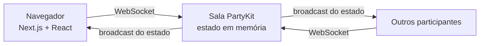

<div align="center">

# 🃏 Planning Poker

**Estimativas em equipe, em tempo real.**
Salas efêmeras, sem cadastro — digite um nome, compartilhe o link e comece a votar.

**▶️ [planning-poker-xi-three.vercel.app](https://planning-poker-xi-three.vercel.app)**

<br/>


</div>

---

## ✨ Funcionalidades

- 🔗 **Sala por link** — crie e compartilhe; entra quem tiver o endereço
- ⚡ **Tempo real** — votos, presença e histórias sincronizam via WebSocket
- 🙈 **Votos ocultos** — o servidor só revela as cartas depois do "Revelar"
- 👑 **Papel de criador** — controles sensíveis restritos a quem abriu a sala
- 📝 **Histórias** — lista lateral com título, descrição e pontuação final
- 📊 **Resultado** — média, distribuição de votos e selo de consenso
- 🎴 **Baralhos** — Fibonacci, Fibonacci modificada, camiseta, potências de 2
- 👀 **Modo espectador** — participa da sala sem votar

---

## 🧱 Stack

| Camada        | Tecnologia                                   | Por quê                                  |
| ------------- | -------------------------------------------- | ---------------------------------------- |
| App / UI      | Next.js (App Router) + React + Tailwind CSS  | Um projeto só para front e rotas         |
| Tempo real    | PartyKit (WebSocket, uma sala por partida)   | "Salas multiplayer" com o mínimo de código |
| Estado        | Em memória no servidor da sala               | Salas são efêmeras — sem banco de dados  |



---

## 👑 O criador da sala

Quem abre a sala vira o **criador**, identificado por um token salvo no navegador
(sobrevive a recarregar a página). Ações restritas ao criador:

| Ação                                   | Criador | Demais |
| -------------------------------------- | :-----: | :----: |
| Votar, virar espectador, mudar de nome |   ✅    |   ✅   |
| Revelar cartas / nova rodada           |   ✅    |   —    |
| Criar, editar, ativar e excluir histórias |  ✅  |   —    |
| Trocar o baralho                       |   ✅    |   —    |
| Definir a pontuação final da história  |   ✅    |   —    |

> Só é possível votar com uma história selecionada. Ao encerrar a votação, o
> sistema calcula a média e sugere a pontuação — o criador confirma ou ajusta.

---

## 🚀 Rodando localmente

```bash
npm install
npm run dev
```

Sobe dois processos em paralelo:

| Serviço  | Endereço                  | Observação                        |
| -------- | ------------------------- | -------------------------------- |
| Next.js  | http://localhost:3000     | interface                        |
| PartyKit | http://127.0.0.1:1999     | tempo real (definido em `.env.local`) |

Abra `http://localhost:3000`, crie uma sala e abra o mesmo link em outra aba ou
dispositivo para ver a sincronização.

---

## ☁️ Deploy

O app está em produção:

| Parte             | URL                                                 |
| ----------------- | --------------------------------------------------- |
| App (Vercel)      | https://planning-poker-xi-three.vercel.app          |
| Tempo real (PartyKit) | `planning-poker-2026.ariribeiro.partykit.dev`   |

Para publicar do zero:

1. **Servidor de tempo real**

   ```bash
   npx partykit login
   npm run deploy:party
   ```

   Anote o host gerado, algo como `planning-poker-2026.SEU_USUARIO.partykit.dev`.

2. **App Next.js** — deploy na Vercel definindo a variável de ambiente
   `NEXT_PUBLIC_PARTYKIT_HOST` (Production + Preview) com o host do passo 1.
   Como tem o prefixo `NEXT_PUBLIC_`, adicione como *não sensível*:

   ```bash
   vercel env add NEXT_PUBLIC_PARTYKIT_HOST production --no-sensitive
   vercel deploy --prod
   ```

---

## 📁 Estrutura

```
app/
  page.tsx            tela inicial — criar sala / entrar por código
  sala/[id]/
    page.tsx
    PokerRoom.tsx      sala completa (client component)
party/
  server.ts           servidor PartyKit — estado + protocolo
lib/
  types.ts            tipos compartilhados (cliente + servidor)
  decks.ts            baralhos e utilitários
```

---

## 🔌 Protocolo (cliente → servidor)

| Grupo       | Mensagens                                                                             |
| ----------- | ------------------------------------------------------------------------------------- |
| Todos       | `join` · `vote` · `setSpectator` · `rename`                                           |
| Só o criador | `reveal` · `reset` · `setDeck` · `addStory` · `updateStory` · `deleteStory` · `setActiveStory` · `setFinalScore` |

O servidor responde com `welcome` (id da conexão) e `state` (snapshot completo da
sala) a cada mudança, e **rejeita silenciosamente** mensagens de criador vindas de
quem não é o criador.

---

## 🤝 Contribuindo

Issues e pull requests são bem-vindos. Antes de abrir um PR, rode
`npm run build` para garantir que o type-check passa.

## 📄 Licença

[MIT](LICENSE) © Ari Ribeiro
